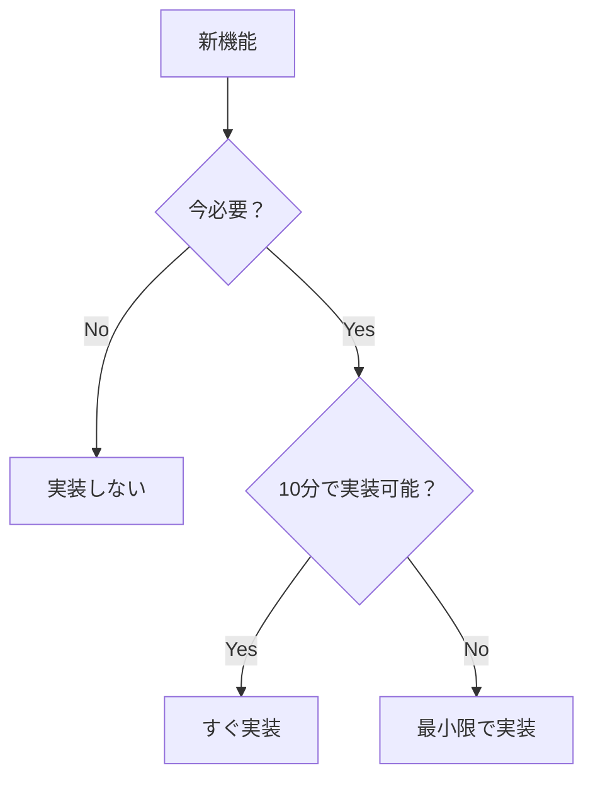

# CLAUDE.md

This file provides guidance to Claude Code (claude.ai/code) when working with code in this repository.

## ⚠️ 重要：実装アプローチの根本的方針

### 最優先原則：MVP優先・YAGNI徹底

```
1. 動く最小版から始める（50行のmain.go）
2. 問題が発生してから対処する
3. 必要になるまで抽象化しない
4. インターフェースは最後の手段
5. YAGNI > DRY > SOLID
```

### 実装の判断基準



**詳細な方針は以下を参照：**
- `docs/IMPLEMENTATION_APPROACH.md` - MVP優先実装戦略
- `docs/SOLID_YAGNI_COMPLIANT_DESIGN_REVISED.md` - 段階的進化型設計
- `docs/IMPLEMENTATION_WORKFLOW_REVISED.md` - MVP優先ワークフロー
- `docs/PROJECT_EXECUTION_PLAN_REVISED.md` - 現実的な実行計画

## Project Overview

Hokku is a **simple** Go-based webhook receiver that saves JSON payloads as files. Starting from a minimal 50-line implementation and growing only as needed.

- **初期実装**: 50行のmain.go
- **Go Version**: 1.21+
- **初期依存**: 標準ライブラリのみ（外部依存なし）
- **段階的追加**: 必要になったら機能追加

## Essential Commands

### 最速で動かす
```bash
# 方法1: 直接実行（最速）
go run cmd/hokku/main.go

# 方法2: デモスクリプト（テスト付き）
./run_demo.sh

# 方法3: ビルドして実行
go build -o bin/hokku cmd/hokku/main.go
./bin/hokku
```

### テスト（必要になったら）
```bash
# 手動テスト優先
curl -X POST localhost:8080/webhook -d '{"title":"test","data":{}}'

# 自動テスト（バグが出たら追加）
go test ./...
```

## Architecture Evolution（段階的進化）

### Stage 0: 単一ファイル（推奨開始点）
```
hokku/
└── main.go              # 全て（50行）
```

### Stage 1: 基本分割（200行超えたら）
```
hokku/
├── main.go              # エントリーポイント
├── handler.go           # ハンドラ
└── storage.go           # ストレージ
```

### Stage 2: パッケージ化（1000行超えたら）
```
hokku/
├── cmd/hokku/main.go
├── internal/handler/
└── internal/storage/
```

### Stage X: SOLID適用（本当に必要になったら）
- インターフェース定義
- 依存性注入
- 抽象化層

## 実装の優先順位

### 必須機能（Phase 0）
- [x] webhook受信
- [x] JSON保存
- [x] 基本エラー処理

### 改善（問題が出たら）
- [ ] ディレクトリ整理
- [ ] ログ追加
- [ ] 設定外部化

### 将来（必要になったら）
- [ ] 認証
- [ ] データベース
- [ ] 非同期処理
- [ ] メトリクス

## Error Handling（シンプルに）

### 初期段階
```go
if err != nil {
    http.Error(w, "Error", 500)
    return
}
```

### 必要になったら
```go
if err != nil {
    log.Printf("Error: %v", err)
    http.Error(w, err.Error(), 500)
    return
}
```

## Testing Strategy（段階的）

### Stage 0: 手動テストのみ
```bash
curl -X POST localhost:8080/webhook -d @test.json
```

### Stage 1: バグが出た箇所のみテスト
```go
func TestBuggyFunction(t *testing.T) {
    // バグの再現テスト
}
```

### Stage 2: 重要な部分のみテスト
- エッジケース
- セキュリティ
- データ破損リスク

## API Endpoints（最小限）

### 初期実装
- `POST /webhook` - Webhook受信

### 必要になったら追加
- `GET /health` - ヘルスチェック
- `GET /metrics` - メトリクス

## Key Implementation Files（現在の実装）

### Phase 0-2で作成済み
- `cmd/hokku/main.go` - 簡易版エントリーポイント（動作確認用）
- `internal/service/filestore.go` - ファイル保存（過剰実装の例）
- `internal/service/validator.go` - バリデーション（過剰実装の例）
- `pkg/security/path.go` - セキュリティ（過剰実装の例）

### 本来の最小実装
```go
// 50行のmain.goだけで十分だった
package main
// ... 最小実装
```

## アンチパターン回避

### ❌ やってはいけないこと
- 最初からインターフェース定義
- 使わない機能の実装
- 過剰な抽象化
- 完璧主義
- 将来の拡張性への過剰な配慮

### ✅ やるべきこと
- 動くコード優先
- 問題が起きてから対処
- シンプルさを保つ
- 実用主義
- YAGNI徹底

## まとめ

**「完璧な設計」より「動くコード」**

1. 30分で動くものを作る
2. 実際に使って問題を発見
3. 必要最小限の改善
4. リファクタリングは最後
5. 抽象化は本当に必要になってから