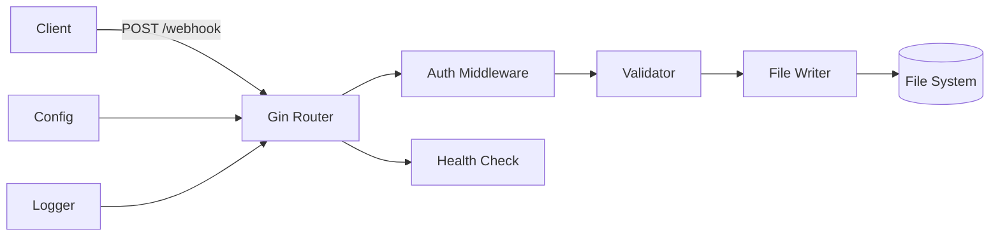

# **Hokku - Webhook File Storage Service 設計仕様書**

**Version:** 1.0.0  
**Date:** 2025-09-07  
**Author:** Hokku Development Team

---

## 1. **概要**

### 1.1 **プロジェクト情報**
- **名称**: Hokku (ホック)
- **概要**: Webhookを受信し、JSONペイロードをファイルとして保存するGoアプリケーション
- **主要機能**: HTTP Webhook受信、ファイル保存、認証、ロギング

### 1.2 **システム要件**
- Go 1.21以上
- Linux/macOS/Windows対応
- 最小メモリ: 256MB
- 推奨ディスク空き容量: 10GB以上

---

## 2. **アーキテクチャ設計**

### 2.1 **システム構成図**



### 2.2 **ディレクトリ構造**

```
hokku/
├── cmd/
│   └── hokku/
│       └── main.go              # エントリーポイント
├── internal/
│   ├── config/
│   │   └── config.go            # 設定管理
│   ├── handler/
│   │   ├── webhook.go           # Webhookハンドラー
│   │   └── health.go            # ヘルスチェック
│   ├── middleware/
│   │   ├── auth.go              # 認証ミドルウェア
│   │   └── logger.go            # ロギングミドルウェア
│   ├── model/
│   │   ├── payload.go           # データモデル
│   │   └── response.go          # レスポンスモデル
│   ├── service/
│   │   ├── file_writer.go       # ファイル書き込みサービス
│   │   └── validator.go         # バリデーションサービス
│   └── util/
│       ├── security.go          # セキュリティユーティリティ
│       └── disk.go              # ディスク管理
├── pkg/
│   └── logger/
│       └── logger.go            # ロガーパッケージ
├── test/
│   ├── unit/                   # ユニットテスト
│   ├── integration/             # 統合テスト
│   └── testdata/               # テストデータ
├── config/
│   ├── config.yaml             # デフォルト設定
│   └── config.example.yaml     # 設定例
├── .env.example                # 環境変数例
├── .gitignore
├── go.mod
├── go.sum
├── Makefile
└── README.md
```

---

## 3. **データモデル**

### 3.1 **リクエスト（Webhook Payload）**

```go
package model

import (
    "time"
    "github.com/google/uuid"
)

type WebhookPayload struct {
    // 必須フィールド
    Title    string `json:"title" validate:"required,max=64"`
    FileName string `json:"filename" validate:"required,filepath,max=255"`
    Body     string `json:"body" validate:"required"`
    
    // オプションフィールド
    Path        string                 `json:"path,omitempty" validate:"omitempty,dirpath"`
    ContentType string                 `json:"content_type,omitempty" validate:"omitempty,oneof=text/plain text/markdown text/html application/json"`
    Encoding    string                 `json:"encoding,omitempty" validate:"omitempty,oneof=utf8 base64"`
    Author      string                 `json:"author,omitempty" validate:"max=100"`
    Source      string                 `json:"source,omitempty" validate:"omitempty,url"`
    Version     string                 `json:"version,omitempty" validate:"omitempty,semver"`
    Tags        []string               `json:"tags,omitempty" validate:"dive,max=50"`
    Metadata    map[string]interface{} `json:"metadata,omitempty"`
    
    // システム生成フィールド
    UUID      uuid.UUID `json:"-"`
    Timestamp time.Time `json:"-"`
}
```

### 3.2 **レスポンス**

```go
type WebhookResponse struct {
    Success   bool      `json:"success"`
    Message   string    `json:"message"`
    UUID      string    `json:"uuid,omitempty"`
    Timestamp time.Time `json:"timestamp"`
    Path      string    `json:"path,omitempty"`
}

type ErrorResponse struct {
    Success   bool      `json:"success"`
    Error     string    `json:"error"`
    Code      string    `json:"code,omitempty"`
    Details   []string  `json:"details,omitempty"`
    Timestamp time.Time `json:"timestamp"`
}
```

---

## 4. **API仕様**

### 4.1 **エンドポイント一覧**

| Method | Path | Description | Auth Required |
|:---|:---|:---|:---:|
| POST | /webhook | Webhookを受信してファイル保存 | ✓ |
| GET | /health | ヘルスチェック | ✗ |
| GET | /metrics | メトリクス取得（将来実装） | ✓ |

### 4.2 **POST /webhook**

**Request:**
```http
POST /webhook HTTP/1.1
Host: localhost:20023
Content-Type: application/json
X-API-Key: your-api-key

{
  "title": "テストドキュメント",
  "filename": "test.md",
  "body": "# Hello World\nThis is a test document.",
  "path": "documents/2025/09",
  "content_type": "text/markdown",
  "author": "John Doe",
  "tags": ["test", "sample"]
}
```

**Success Response (200):**
```json
{
  "success": true,
  "message": "File saved successfully",
  "uuid": "550e8400-e29b-41d4-a716-446655440000",
  "timestamp": "2025-09-07T10:30:00+09:00",
  "path": "/base/documents/2025/09/test.md"
}
```

**Error Response (400/500):**
```json
{
  "success": false,
  "error": "Validation failed",
  "code": "VALIDATION_ERROR",
  "details": [
    "title: must be no more than 64 characters",
    "filename: invalid characters detected"
  ],
  "timestamp": "2025-09-07T10:30:00+09:00"
}
```

---

## 5. **設定仕様**

### 5.1 **設定ファイル (config.yaml)**

```yaml
# Hokku Configuration
app:
  name: hokku
  version: 1.0.0
  env: development  # development, staging, production

server:
  host: 0.0.0.0
  port: 20023
  read_timeout: 30s
  write_timeout: 30s
  max_header_bytes: 1048576  # 1MB
  graceful_timeout: 30s

storage:
  base_dir: ./storage
  disk_quota: 1073741824  # 1GB in bytes
  create_dirs: true
  file_permissions: 0644
  dir_permissions: 0755

auth:
  enabled: true
  type: api_key  # api_key, oauth2, jwt (将来実装)
  api_keys:
    - key: dev-key-001
      name: Development
      enabled: true
  # OAuth2設定（将来実装）
  oauth2:
    enabled: false
    provider: google
    client_id: ""
    client_secret: ""
    redirect_url: ""

validation:
  max_payload_size: 10485760  # 10MB
  allowed_extensions:
    - .txt
    - .md
    - .json
    - .html
    - .xml
  forbidden_patterns:
    - "../"
    - ".."
    - "~"

logging:
  level: info  # debug, info, warn, error
  format: json  # json, text
  output: stdout  # stdout, file, syslog
  file:
    path: ./logs/hokku.log
    max_size: 100  # MB
    max_backups: 10
    max_age: 30  # days

monitoring:
  metrics_enabled: false  # 将来実装
  health_check_path: /health
```

### 5.2 **環境変数**

```bash
# .env.example
HOKKU_ENV=development
HOKKU_PORT=20023
HOKKU_BASE_DIR=./storage
HOKKU_API_KEY=dev-key-001
HOKKU_LOG_LEVEL=info
HOKKU_DISK_QUOTA=1073741824
```

---

## 6. **実装詳細**

### 6.1 **メイン処理フロー**

```go
// cmd/hokku/main.go
package main

import (
    "context"
    "fmt"
    "net/http"
    "os"
    "os/signal"
    "syscall"
    "time"

    "github.com/gin-gonic/gin"
    "github.com/yourusername/hokku/internal/config"
    "github.com/yourusername/hokku/internal/handler"
    "github.com/yourusername/hokku/internal/middleware"
    "github.com/yourusername/hokku/internal/service"
    "github.com/yourusername/hokku/pkg/logger"
    "go.uber.org/zap"
)

func main() {
    // 設定読み込み
    cfg, err := config.Load()
    if err != nil {
        panic(fmt.Sprintf("Failed to load config: %v", err))
    }

    // ロガー初期化
    log, err := logger.New(cfg.Logging)
    if err != nil {
        panic(fmt.Sprintf("Failed to initialize logger: %v", err))
    }
    defer log.Sync()

    // Ginセットアップ
    if cfg.App.Env == "production" {
        gin.SetMode(gin.ReleaseMode)
    }

    router := gin.New()
    router.Use(
        middleware.Logger(log),
        middleware.Recovery(),
        gin.Recovery(),
    )

    // サービス初期化
    fileWriter := service.NewFileWriter(cfg.Storage, log)
    validator := service.NewValidator(cfg.Validation)

    // ハンドラー登録
    h := handler.NewWebhookHandler(fileWriter, validator, log)

    // ルート設定
    router.GET("/health", handler.Health)
    
    // 認証が必要なエンドポイント
    api := router.Group("/")
    if cfg.Auth.Enabled {
        api.Use(middleware.Auth(cfg.Auth))
    }
    api.POST("/webhook", h.HandleWebhook)

    // サーバー起動
    srv := &http.Server{
        Addr:           fmt.Sprintf("%s:%d", cfg.Server.Host, cfg.Server.Port),
        Handler:        router,
        ReadTimeout:    cfg.Server.ReadTimeout,
        WriteTimeout:   cfg.Server.WriteTimeout,
        MaxHeaderBytes: cfg.Server.MaxHeaderBytes,
    }

    // Graceful shutdown
    go func() {
        log.Info("Server started", 
            zap.String("host", cfg.Server.Host),
            zap.Int("port", cfg.Server.Port))
        
        if err := srv.ListenAndServe(); err != nil && err != http.ErrServerClosed {
            log.Fatal("Server failed to start", zap.Error(err))
        }
    }()

    // シグナル待機
    quit := make(chan os.Signal, 1)
    signal.Notify(quit, syscall.SIGINT, syscall.SIGTERM)
    <-quit

    log.Info("Shutting down server...")

    ctx, cancel := context.WithTimeout(context.Background(), cfg.Server.GracefulTimeout)
    defer cancel()

    if err := srv.Shutdown(ctx); err != nil {
        log.Error("Server forced to shutdown", zap.Error(err))
    }

    log.Info("Server exited")
}
```

### 6.2 **ファイル書き込みサービス**

```go
// internal/service/file_writer.go
package service

import (
    "fmt"
    "os"
    "path/filepath"
    "encoding/base64"
    
    "github.com/yourusername/hokku/internal/model"
    "github.com/yourusername/hokku/internal/util"
    "go.uber.org/zap"
)

type FileWriter struct {
    config *config.StorageConfig
    logger *zap.Logger
}

func (fw *FileWriter) Write(payload *model.WebhookPayload) (string, error) {
    // ディスク容量チェック
    if err := util.CheckDiskSpace(fw.config.BaseDir, fw.config.DiskQuota); err != nil {
        return "", fmt.Errorf("disk space check failed: %w", err)
    }

    // パス構築とセキュリティチェック
    fullPath := fw.buildPath(payload.Path, payload.FileName)
    if err := util.ValidatePath(fullPath); err != nil {
        return "", fmt.Errorf("invalid path: %w", err)
    }

    // ディレクトリ作成
    dir := filepath.Dir(fullPath)
    if err := os.MkdirAll(dir, os.FileMode(fw.config.DirPermissions)); err != nil {
        return "", fmt.Errorf("failed to create directory: %w", err)
    }

    // ファイル存在チェック
    if _, err := os.Stat(fullPath); err == nil {
        return "", fmt.Errorf("file already exists: %s", fullPath)
    }

    // コンテンツ準備
    content := payload.Body
    if payload.Encoding == "base64" {
        decoded, err := base64.StdEncoding.DecodeString(payload.Body)
        if err != nil {
            return "", fmt.Errorf("base64 decode failed: %w", err)
        }
        content = string(decoded)
    }

    // ファイル書き込み
    if err := os.WriteFile(fullPath, []byte(content), os.FileMode(fw.config.FilePermissions)); err != nil {
        return "", fmt.Errorf("failed to write file: %w", err)
    }

    fw.logger.Info("File written successfully",
        zap.String("path", fullPath),
        zap.String("uuid", payload.UUID.String()))

    return fullPath, nil
}
```

---
## 7. テスト戦略

### 7.1 **実装順序（TDD）**

1. **Phase 1: コア機能**
   - ファイル書き込みサービスのテスト実装
   - JSONペイロードのバリデーションテスト
   - パスセキュリティチェックのテスト

2. **Phase 2: API層**
   - Webhookハンドラーのテスト
   - ヘルスチェックエンドポイントのテスト
   - レスポンスフォーマットのテスト

3. **Phase 3: 認証・設定**
   - APIキー認証のテスト
   - 設定ファイル読み込みのテスト
   - 環境変数オーバーライドのテスト

### 7.2 **テストコード例**

```go
// test/unit/service/file_writer_test.go
package service_test

import (
    "os"
    "path/filepath"
    "testing"
    
    "github.com/stretchr/testify/assert"
    "github.com/stretchr/testify/require"
    "github.com/google/uuid"
    "github.com/yourusername/hokku/internal/model"
    "github.com/yourusername/hokku/internal/service"
)

func TestFileWriter_Write(t *testing.T) {
    // テスト用の一時ディレクトリ作成
    tempDir := t.TempDir()
    
    tests := []struct {
        name    string
        payload *model.WebhookPayload
        wantErr bool
        errMsg  string
    }{
        {
            name: "正常なファイル書き込み",
            payload: &model.WebhookPayload{
                Title:    "Test Document",
                FileName: "test.md",
                Body:     "# Test Content",
                Path:     "docs",
                UUID:     uuid.New(),
            },
            wantErr: false,
        },
        {
            name: "ディレクトリトラバーサル検出",
            payload: &model.WebhookPayload{
                Title:    "Bad Document",
                FileName: "../../../etc/passwd",
                Body:     "malicious content",
                UUID:     uuid.New(),
            },
            wantErr: true,
            errMsg:  "invalid path",
        },
        {
            name: "既存ファイルの重複エラー",
            payload: &model.WebhookPayload{
                Title:    "Duplicate",
                FileName: "existing.txt",
                Body:     "content",
                UUID:     uuid.New(),
            },
            wantErr: true,
            errMsg:  "file already exists",
        },
    }
    
    for _, tt := range tests {
        t.Run(tt.name, func(t *testing.T) {
            // FileWriter初期化
            fw := service.NewFileWriter(tempDir, logger)
            
            // 既存ファイルテスト用の準備
            if tt.name == "既存ファイルの重複エラー" {
                existingPath := filepath.Join(tempDir, tt.payload.FileName)
                require.NoError(t, os.WriteFile(existingPath, []byte("existing"), 0644))
            }
            
            // テスト実行
            path, err := fw.Write(tt.payload)
            
            if tt.wantErr {
                assert.Error(t, err)
                assert.Contains(t, err.Error(), tt.errMsg)
            } else {
                assert.NoError(t, err)
                assert.NotEmpty(t, path)
                
                // ファイル内容確認
                content, err := os.ReadFile(path)
                assert.NoError(t, err)
                assert.Equal(t, tt.payload.Body, string(content))
            }
        })
    }
}
```

---

## 8. **セキュリティ実装**

### 8.1 **パスバリデーション**

```go
// internal/util/security.go
package util

import (
    "errors"
    "path/filepath"
    "strings"
)

var (
    ErrInvalidPath = errors.New("invalid path")
    ErrInvalidFileName = errors.New("invalid filename")
)

// ValidatePath ディレクトリトラバーサル対策
func ValidatePath(path string) error {
    // 正規化
    cleaned := filepath.Clean(path)
    
    // 危険なパターンチェック
    dangerousPatterns := []string{
        "..",
        "~",
        "//",
        "\\",
    }
    
    for _, pattern := range dangerousPatterns {
        if strings.Contains(cleaned, pattern) {
            return ErrInvalidPath
        }
    }
    
    // 絶対パスチェック
    if filepath.IsAbs(cleaned) {
        return ErrInvalidPath
    }
    
    return nil
}

// ValidateFileName ファイル名のバリデーション
func ValidateFileName(name string) error {
    // 禁止文字チェック
    invalidChars := []string{
        "/", "\\", ":", "*", "?", "\"", "<", ">", "|",
        "\x00", "\n", "\r", "\t",
    }
    
    for _, char := range invalidChars {
        if strings.Contains(name, char) {
            return ErrInvalidFileName
        }
    }
    
    // 長さチェック
    if len(name) > 255 {
        return ErrInvalidFileName
    }
    
    // 予約語チェック（Windows）
    reserved := []string{
        "CON", "PRN", "AUX", "NUL",
        "COM1", "COM2", "COM3", "COM4",
        "LPT1", "LPT2", "LPT3",
    }
    
    nameUpper := strings.ToUpper(strings.TrimSuffix(name, filepath.Ext(name)))
    for _, r := range reserved {
        if nameUpper == r {
            return ErrInvalidFileName
        }
    }
    
    return nil
}
```

### 8.2 **認証ミドルウェア**

```go
// internal/middleware/auth.go
package middleware

import (
    "net/http"
    
    "github.com/gin-gonic/gin"
)

func Auth(config AuthConfig) gin.HandlerFunc {
    return func(c *gin.Context) {
        // APIキー認証（初期実装）
        if config.Type == "api_key" {
            apiKey := c.GetHeader("X-API-Key")
            if apiKey == "" {
                apiKey = c.Query("api_key")
            }
            
            if !isValidAPIKey(apiKey, config.APIKeys) {
                c.JSON(http.StatusUnauthorized, gin.H{
                    "success": false,
                    "error":   "Invalid or missing API key",
                })
                c.Abort()
                return
            }
        }
        
        c.Next()
    }
}
```

---

## 9. **ビルド・デプロイ**

### 9.1 **Makefile**

```makefile
# Makefile
.PHONY: help build run test clean

BINARY_NAME=hokku
VERSION=$(shell git describe --tags --always --dirty)
BUILD_TIME=$(shell date +%FT%T%z)
LDFLAGS=-ldflags "-X main.Version=${VERSION} -X main.BuildTime=${BUILD_TIME}"

help: ## ヘルプを表示
	@grep -E '^[a-zA-Z_-]+:.*?## .*$$' $(MAKEFILE_LIST) | awk 'BEGIN {FS = ":.*?## "}; {printf "\033[36m%-20s\033[0m %s\n", $$1, $$2}'

build: ## バイナリをビルド
	go build ${LDFLAGS} -o bin/${BINARY_NAME} cmd/hokku/main.go

run: ## アプリケーションを実行
	go run cmd/hokku/main.go

test: ## テストを実行
	go test -v -race -coverprofile=coverage.out ./...

test-coverage: test ## カバレッジレポートを表示
	go tool cover -html=coverage.out

lint: ## Lintを実行
	golangci-lint run

clean: ## ビルド成果物を削除
	rm -rf bin/ coverage.out

install: ## バイナリをインストール
	go install ${LDFLAGS} ./cmd/hokku

dev: ## 開発モードで起動（ホットリロード）
	air -c .air.toml
```

### 9.2 **GitHub Actions CI/CD**

```yaml
# .github/workflows/ci.yml
name: CI

on:
  push:
    branches: [ main, develop ]
  pull_request:
    branches: [ main ]

jobs:
  test:
    runs-on: ubuntu-latest
    steps:
    - uses: actions/checkout@v3
    
    - name: Set up Go
      uses: actions/setup-go@v4
      with:
        go-version: '1.21'
    
    - name: Cache Go modules
      uses: actions/cache@v3
      with:
        path: ~/go/pkg/mod
        key: ${{ runner.os }}-go-${{ hashFiles('**/go.sum') }}
        restore-keys: |
          ${{ runner.os }}-go-
    
    - name: Install dependencies
      run: go mod download
    
    - name: Run tests
      run: make test
    
    - name: Upload coverage
      uses: codecov/codecov-action@v3
      with:
        file: ./coverage.out
    
    - name: Build binary
      run: make build
    
    - name: Upload artifact
      uses: actions/upload-artifact@v3
      with:
        name: hokku-binary
        path: bin/hokku

  lint:
    runs-on: ubuntu-latest
    steps:
    - uses: actions/checkout@v3
    - uses: golangci/golangci-lint-action@v3
      with:
        version: latest
```

---

## 10. **運用・監視**

### 10.1 **ログフォーマット**

```json
// アクセスログ（Apache風）
{
  "timestamp": "2025-09-07T10:30:00+09:00",
  "level": "info",
  "remote_ip": "192.168.1.100",
  "method": "POST",
  "path": "/webhook",
  "status": 200,
  "latency": 45,
  "user_agent": "Mozilla/5.0",
  "request_id": "req-123456"
}

// エラーログ
{
  "timestamp": "2025-09-07T10:31:00+09:00",
  "level": "error",
  "error": "disk space insufficient",
  "details": {
    "available": 524288000,
    "required": 1073741824
  },
  "stack_trace": "...",
  "request_id": "req-123457"
}
```

### 10.2 **ヘルスチェック実装**

```go
// internal/handler/health.go
package handler

import (
    "net/http"
    "runtime"
    
    "github.com/gin-gonic/gin"
    "github.com/shirou/gopsutil/v3/disk"
)

func Health(c *gin.Context) {
    // ディスク使用状況チェック
    usage, err := disk.Usage("/")
    
    health := gin.H{
        "status": "healthy",
        "version": Version,
        "uptime": time.Since(startTime).Seconds(),
        "goroutines": runtime.NumGoroutine(),
        "memory": getMemoryStats(),
    }
    
    if err == nil {
        health["disk"] = gin.H{
            "total": usage.Total,
            "free": usage.Free,
            "used_percent": usage.UsedPercent,
        }
    }
    
    c.JSON(http.StatusOK, health)
}
```

---

## 11. **将来の拡張計画**

### 11.1 **ロードマップ**

| Phase | 機能 | 優先度 | 目標時期 |
|:---|:---|:---:|:---|
| Phase 1 | 基本機能実装 | 必須 | 1ヶ月 |
| Phase 2 | Web UI（管理画面） | 高 | 2ヶ月 |
| Phase 3 | OAuth2/JWT認証 | 高 | 3ヶ月 |
| Phase 4 | gRPC対応 | 中 | 4ヶ月 |
| Phase 5 | メトリクスダッシュボード | 中 | 5ヶ月 |
| Phase 6 | イベント通知機能 | 中 | 6ヶ月 |

### 11.2 **部分的失敗のロールバック考慮事項**

部分的失敗が発生する可能性のあるケース：
1. **ネットワーク断絶**: ファイル書き込み中の切断
2. **プロセス強制終了**: SIGKILLによる中断
3. **ファイルシステムエラー**: I/Oエラー、権限変更

対策案（将来実装）：
- 一時ファイルへの書き込み後、アトミックな移動
- ジャーナリング機能の実装
- チェックポイント機能

---

## 12. **開始手順**

```bash
# 1. プロジェクト初期化
mkdir hokku && cd hokku
go mod init github.com/yourusername/hokku

# 2. 依存パッケージインストール
go get github.com/gin-gonic/gin
go get github.com/spf13/viper
go get go.uber.org/zap
go get github.com/go-playground/validator/v10
go get github.com/google/uuid
go get github.com/stretchr/testify

# 3. ディレクトリ構造作成
make setup

# 4. 開発開始（TDD）
# まずテストを書く
vim test/unit/service/file_writer_test.go

# 5. 実装
vim internal/service/file_writer.go

# 6. テスト実行
make test

# 7. 起動
make run
```


