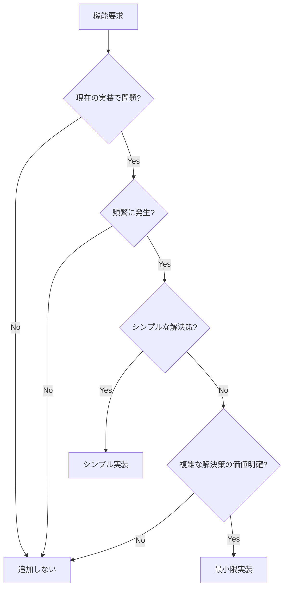

# Hokku MVP優先実装ワークフロー

**Version:** 2.0.0  
**Date:** 2025-09-08  
**Author:** Development Team  
**Approach:** MVP-First with Progressive SOLID Application

---

## Table of Contents

1. [Overview](#overview)
2. [MVP原則](#mvp原則)
3. [Phase Structure](#phase-structure)
4. [Implementation Phases](#implementation-phases)
5. [Progressive Quality Gates](#progressive-quality-gates)
6. [TDD Application Strategy](#tdd-application-strategy)
7. [Decision Framework](#decision-framework)
8. [Commands Reference](#commands-reference)

---

## Overview

このワークフローはMVP（最小限実行可能製品）優先アプローチを採用し、SOLID原則を段階的に適用します。「動く→改善→抽象化」の順序で実装し、必要性が明確になった時点で品質向上を図ります。

### 核心原則
- **動作最優先**: まず動くものを作る
- **必要性駆動**: 必要になってから機能追加
- **段階的品質向上**: Phase毎に品質基準を上げる
- **証拠ベース判断**: 推測ではなく実際の問題で判断

---

## MVP原則

### YAGNI (You Aren't Gonna Need It) の徹底
```yaml
実装判断基準:
  今必要: → 実装する
  将来必要かも: → 実装しない
  
機能追加判断フロー:
  1. 現在の実装で問題があるか？
     No → 追加しない
  2. 問題は頻繁に発生するか？  
     No → 追加しない
  3. シンプルな解決策はあるか？
     Yes → シンプルな解決策を実装
  4. 複雑な解決策の価値は明確か？
     No → 追加しない
     Yes → 最小限の実装
```

### 段階的複雑性管理
```
Phase 0: 10-50行の単一ファイル
Phase 1: 100-200行、基本的な関数分離
Phase 2: 300-500行、必要な抽象化のみ
Phase 3: 完全な構造（必要性が明確になったら）
```

---

## Phase Structure

### Dependencies Map
```
Phase 0 (30分) → Phase 1 (1時間) → Phase 2 (1時間) → Phase 3 (必要に応じて)
     ↓              ↓                ↓                   ↓
   動作確認      基本品質向上      必要な抽象化        完全なSOLID
```

### Progressive Quality Standards
```yaml
Phase 0: 動作するのみ
  - go run main.go が動作する
  - curl テストが通る
  - 品質チェック: なし

Phase 1: 基本品質
  - go vet通る  
  - 基本的なテスト
  - 品質チェック: 最小限

Phase 2: 実用品質
  - golangci-lint通る
  - 適切なテスト カバレッジ
  - 品質チェック: 中程度

Phase 3: プロダクション品質  
  - 全品質ゲート適用
  - 80%+ テストカバレッジ
  - 品質チェック: 厳格
```

---

## Implementation Phases

### Phase 0: 最小動作版 (30分)

**目標**: とにかく動くwebhookサーバーを作る

**実装内容**:
```go
// main.go (約50行)
package main

import (
    "encoding/json"
    "fmt"
    "io"
    "net/http"
    "os"
    "time"
)

func main() {
    http.HandleFunc("/webhook", func(w http.ResponseWriter, r *http.Request) {
        body, err := io.ReadAll(r.Body)
        if err != nil {
            http.Error(w, "Cannot read body", 400)
            return
        }
        
        var data map[string]interface{}
        if err := json.Unmarshal(body, &data); err != nil {
            http.Error(w, "Invalid JSON", 400)
            return
        }
        
        filename := fmt.Sprintf("webhook_%d.json", time.Now().Unix())
        if err := os.WriteFile(filename, body, 0644); err != nil {
            http.Error(w, "Cannot save file", 500)
            return
        }
        
        w.WriteHeader(200)
        json.NewEncoder(w).Encode(map[string]string{
            "status": "saved",
            "file": filename,
        })
    })
    
    fmt.Println("Server starting on :8080")
    http.ListenAndServe(":8080", nil)
}
```

**動作確認**:
```bash
# サーバー起動
go run main.go

# 別ターミナルでテスト
curl -X POST localhost:8080/webhook -d '{"test":"data"}'
```

**Phase 0完了基準**:
- [ ] サーバーが起動する
- [ ] curlリクエストが成功する（200 OK）  
- [ ] JSONファイルが作成される
- [ ] レスポンスが返る

**進行判断**: 基本的な改善が必要になったらPhase 1へ

### Phase 1: 基本品質向上 (1時間)

**目標**: 最低限の品質とセキュリティを追加

**追加する機能**:
- storageディレクトリ作成
- titleフィールド必須化  
- 基本的なログ出力
- ヘルスチェックエンドポイント

**実装差分**:
```go
// ディレクトリ作成
os.MkdirAll("storage", 0755)

// titleチェック
if data["title"] == nil || data["title"] == "" {
    http.Error(w, "title is required", 400)
    return  
}

// ファイル名にタイトルを含める
title := fmt.Sprintf("%v", data["title"])
filename := fmt.Sprintf("storage/%d_%s.json", time.Now().Unix(), title)

// ヘルスチェック
http.HandleFunc("/health", func(w http.ResponseWriter, r *http.Request) {
    w.WriteHeader(200)
    json.NewEncoder(w).Encode(map[string]string{"status": "healthy"})
})
```

**基本テスト追加**:
```go
// main_test.go
package main

import (
    "bytes"
    "net/http"
    "net/http/httptest"
    "testing"
)

func TestWebhookBasic(t *testing.T) {
    req := httptest.NewRequest("POST", "/webhook", 
        bytes.NewBufferString(`{"title":"test","data":"content"}`))
    w := httptest.NewRecorder()
    
    // テスト実装
}
```

**Phase 1完了基準**:
- [ ] go vet ./... が通る
- [ ] 基本テストが通る
- [ ] titleが必須になっている
- [ ] storageディレクトリが作成される
- [ ] /health エンドポイントが動作する

**進行判断**: セキュリティ問題やファイル名の問題が発生したらPhase 2へ

### Phase 2: セキュリティ最小限 (1時間)  

**目標**: 最低限のセキュリティ対策

**追加する機能**:
- ファイル名サニタイゼーション
- パストラバーサル防止
- 環境変数での設定

**実装例**:
```go
// サニタイゼーション関数追加
func sanitize(s string) string {
    s = strings.ReplaceAll(s, "/", "_")
    s = strings.ReplaceAll(s, "..", "_")
    s = strings.ReplaceAll(s, "\x00", "_")
    if len(s) > 100 {
        s = s[:100]
    }
    return s
}

// 環境変数サポート
port := os.Getenv("PORT")
if port == "" {
    port = "8080"
}

storagePath := os.Getenv("STORAGE_PATH")  
if storagePath == "" {
    storagePath = "./storage"
}
```

**セキュリティテスト追加**:
```go
func TestSecuritySanitization(t *testing.T) {
    // パストラバーサル攻撃テスト
    // 長すぎるファイル名テスト
    // 不正文字テスト
}
```

**Phase 2完了基準**:
- [ ] パストラバーサル攻撃が防げる
- [ ] ファイル名が安全にサニタイズされる  
- [ ] 環境変数で設定変更可能
- [ ] セキュリティテストが通る
- [ ] golangci-lint が通る

**進行判断**: さらなる機能が必要になったらPhase 3へ

### Phase 3: 必要に応じた拡張 (必要になったら)

**目標**: 本格的な機能と品質が必要になったら実装

**条件付き追加機能**:
```yaml
エラーハンドリング改善:
  trigger: エラーが分かりにくいという問題発生時
  implementation: JSONエラーレスポンス、エラーコード

設定管理:
  trigger: 設定項目が5個を超えた時
  implementation: YAML設定ファイル、構造体

認証:
  trigger: 外部公開が必要になった時
  implementation: APIキー認証

ログ改善:
  trigger: デバッグが困難になった時
  implementation: 構造化ログ

リファクタリング:
  trigger: ファイルが300行を超えた時
  implementation: 関数分離、ファイル分割

抽象化:
  trigger: テストが困難になった時
  implementation: インターフェース導入

本格的な構造:
  trigger: チーム開発が必要になった時
  implementation: internal/パッケージ、SOLID設計
```

---

## Progressive Quality Gates

### Gate 0: 動作確認のみ (Phase 0)
```bash
# 手動テストのみ
go run main.go
curl -X POST localhost:8080/webhook -d '{"title":"test"}'
```

### Gate 1: 基本品質 (Phase 1)
```bash
go vet ./...
go test -v ./...
```

### Gate 2: セキュリティ品質 (Phase 2)
```bash
go vet ./...
go test -v ./...  
golangci-lint run --fast
```

### Gate 3: プロダクション品質 (Phase 3)
```bash
go vet ./...
go test -v -race -cover ./...
golangci-lint run
gosec ./...
```

---

## TDD Application Strategy

### Phase 0: TDD適用なし
- 動作確認のみ
- 手動テストで十分

### Phase 1: 最小限のTDD
```go
// 最小限のテストを後から追加
func TestWebhookBasic(t *testing.T) {
    // 基本的な動作テストのみ
}
```

### Phase 2: 必要箇所のTDD
```go
// セキュリティ関連機能のみTDD
func TestSanitization(t *testing.T) {
    // テスト → 実装の順序
}
```

### Phase 3: 完全なTDD (必要になったら)
```go
// すべての新機能でテスト → 実装
```

---

## Decision Framework

### 次のPhaseに進む判断基準

**Phase 0 → Phase 1**:
```
以下のいずれかが発生:
- ファイル名に問題のある文字が入る
- エラーメッセージが分かりにくい
- 設定を変更したい要求がある
- 基本的なテストが欲しくなる
```

**Phase 1 → Phase 2**:
```
以下のいずれかが発生:
- セキュリティ問題が発見される
- ファイル名にパスが含まれる
- 外部からの攻撃を考慮する必要
- 設定項目が増える
```

**Phase 2 → Phase 3**:
```  
以下のいずれかが発生:
- コードが300行を超える
- テストが困難になる
- 複数人での開発が必要
- エラーハンドリングが複雑になる
- 認証が必要になる
```

### 機能追加の判断フロー


---

## Commands Reference

### Phase 0 Commands
```bash
# 実装・実行
go run main.go

# 動作確認
curl -X POST localhost:8080/webhook -d '{"title":"test","data":"hello"}'
curl localhost:8080/health
```

### Phase 1 Commands  
```bash
# 品質チェック
go vet ./...
go test -v ./...

# 実行
go run main.go
```

### Phase 2 Commands
```bash
# セキュリティチェック
go vet ./...  
go test -v ./...
golangci-lint run --fast

# セキュリティテスト
curl -X POST localhost:8080/webhook -d '{"title":"../../../etc/passwd"}'
```

### Phase 3 Commands (必要に応じて)
```bash
# 完全品質チェック
make test-coverage
make lint  
make security-check
make build
```

---

## まとめ

このワークフローは以下を保証します：

1. **迅速な価値提供**: Phase 0で30分以内に動作するサービス
2. **需要駆動開発**: 実際の問題が発生してから機能追加  
3. **段階的品質向上**: Phase毎に適切なレベルの品質確保
4. **オーバーエンジニアリング防止**: YAGNI原則の徹底適用
5. **持続可能な開発**: 必要に応じたSOLID原則の段階適用

**核心メッセージ**: 「将来必要になるかも」は実装しない理由。「今必要」だけが実装する理由。