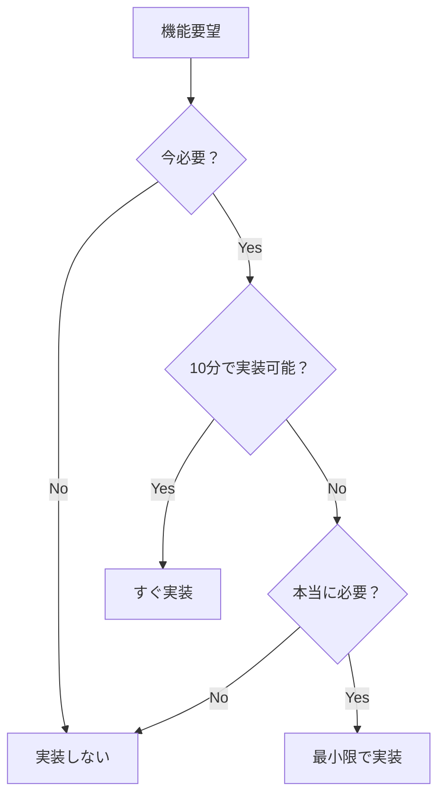

# Hokku - MVP優先実装ワークフロー

## ⚠️ 根本的な方針転換

### ❌ 従来のTDD/設計先行アプローチ
```
1. 要件定義
2. 設計ドキュメント作成
3. インターフェース定義
4. テスト作成
5. 実装
6. リファクタリング
問題：動くものができるまで時間がかかりすぎる
```

### ✅ MVP優先の実装アプローチ
```
1. 動く最小版を作る（30分）
2. 実際に動かす
3. 問題があれば修正
4. 必要ならテスト追加
5. 必要ならリファクタリング
利点：すぐに動作確認できる
```

## Phase 0: 最小動作版（30分で完成）

### 目標
**動くものを30分で作る**

### 実装手順
```bash
# 1. main.goを作成（50行以内）
cat > main.go << 'EOF'
package main

import (
    "encoding/json"
    "fmt"
    "io"
    "net/http"
    "os"
    "time"
)

func main() {
    http.HandleFunc("/webhook", func(w http.ResponseWriter, r *http.Request) {
        body, _ := io.ReadAll(r.Body)
        var data map[string]interface{}
        if json.Unmarshal(body, &data) != nil {
            http.Error(w, "Invalid JSON", 400)
            return
        }
        filename := fmt.Sprintf("webhook_%d.json", time.Now().Unix())
        os.WriteFile(filename, body, 0644)
        json.NewEncoder(w).Encode(map[string]string{"status": "ok"})
    })
    fmt.Println("Server starting on :8080")
    http.ListenAndServe(":8080", nil)
}
EOF

# 2. 実行
go run main.go

# 3. テスト
curl -X POST localhost:8080/webhook -d '{"test":"data"}'

# 完了！
```

### チェックリスト
- [ ] 30分以内に完成
- [ ] 動作確認済み
- [ ] テスト不要（手動確認で十分）
- [ ] ドキュメント不要（コードが自明）

## Phase 1: 最小限の改善（1時間）

### トリガー
- ユーザーから具体的な要望があった場合のみ

### 改善例
```go
// 問題：ファイルが散らかる
// 解決：ディレクトリ作成（+2行）
os.MkdirAll("storage", 0755)
filename := fmt.Sprintf("storage/webhook_%d.json", ...)

// 問題：エラーが分からない
// 解決：ログ追加（+1行）
log.Printf("Saved: %s", filename)

// 問題：タイトルがない
// 解決：チェック追加（+3行）
if data["title"] == nil {
    http.Error(w, "title required", 400)
    return
}
```

### アンチパターン回避
```go
// ❌ 悪い：過剰な検証
type Validator struct {
    Rules []ValidationRule
}

// ✅ 良い：最小限のチェック
if data["title"] == nil {
    // エラー
}
```

## Phase 2: セキュリティ対応（必要になったら）

### トリガー
- 外部公開が決まった
- セキュリティ問題が報告された

### 最小限の対応
```go
// パストラバーサル対策（+5行）
title := strings.ReplaceAll(title, "/", "_")
title = strings.ReplaceAll(title, "..", "_")

// 認証（+3行）
if r.Header.Get("Token") != "secret" {
    http.Error(w, "Unauthorized", 401)
    return
}
```

## Phase 3: テスト追加（バグが出たら）

### トリガー
- バグが発生した
- リグレッションを防ぎたい

### 最小限のテスト
```go
// handler_test.go - バグが出た部分だけ
func TestTitleValidation(t *testing.T) {
    // バグ：タイトルなしでクラッシュ
    resp := httptest.NewRecorder()
    req := httptest.NewRequest("POST", "/webhook", 
        strings.NewReader(`{"no_title": true}`))
    
    handleWebhook(resp, req)
    
    if resp.Code != 400 {
        t.Errorf("Expected 400, got %d", resp.Code)
    }
}
```

### テスト不要な部分
- 標準ライブラリの動作
- 外部ツールの動作
- 自明な処理

## Phase 4: リファクタリング（コードが汚くなったら）

### トリガー
- 同じコードを3回書いた
- 関数が50行を超えた
- ファイルが200行を超えた

### 段階的リファクタリング

#### Step 1: 関数抽出（100行超えたら）
```go
// Before: main関数に全て
func main() {
    http.HandleFunc("/webhook", func(w http.ResponseWriter, r *http.Request) {
        // 50行の処理
    })
}

// After: 関数に分割
func handleWebhook(w http.ResponseWriter, r *http.Request) {
    // 処理
}

func main() {
    http.HandleFunc("/webhook", handleWebhook)
}
```

#### Step 2: ファイル分割（300行超えたら）
```
main.go     → main.go + handler.go
handler.go  → handler.go + storage.go
```

#### Step 3: パッケージ化（1000行超えたら）
```
main.go → cmd/hokku/main.go
handler.go → internal/handler/webhook.go
```

## ワークフローの判断基準

### 実装する/しないの判断



### コード品質の判断

| 状況 | 対応 |
|------|------|
| 動かない | すぐ修正 |
| 動くが汚い | そのまま |
| 汚くて変更が大変 | リファクタリング |
| きれいだが複雑 | シンプルに書き直し |

## アンチパターンと対策

### 1. 早すぎる抽象化
```go
// ❌ 悪い：最初からインターフェース
type Storage interface {
    Save(data []byte) error
}

// ✅ 良い：具体実装
func saveToFile(data []byte) error {
    return os.WriteFile("file.json", data, 0644)
}
```

### 2. 過剰なエラーハンドリング
```go
// ❌ 悪い：カスタムエラー型
type ValidationError struct {
    Field string
    Rule  string
    Value interface{}
}

// ✅ 良い：シンプルなエラー
if title == "" {
    return errors.New("title required")
}
```

### 3. 不要な設定管理
```go
// ❌ 悪い：設定ファイル
type Config struct {
    Port            int
    StoragePath     string
    MaxFileSize     int64
    // 20個の設定項目...
}

// ✅ 良い：定数かコード埋め込み
const port = "8080"
const storagePath = "./storage"
```

## 実装スピードの目安

| フェーズ | 所要時間 | 成果物 |
|---------|---------|--------|
| Phase 0 | 30分 | 動くWebhookレシーバー |
| Phase 1 | 1時間 | 基本的な改善 |
| Phase 2 | 1時間 | セキュリティ対応 |
| Phase 3 | 2時間 | 必要なテストのみ |
| Phase 4 | 2時間 | リファクタリング |

**合計：1日で実用的なWebhookレシーバーが完成**

## 重要な原則

### 1. 動作優先
```
動かないきれいなコード < 動く汚いコード
```

### 2. 増分開発
```
完璧な計画 < 小さな改善の積み重ね
```

### 3. YAGNI徹底
```
「将来必要かも」→ 実装しない
「今必要」→ 最小限で実装
```

### 4. 実用主義
```
理論的な正しさ < 実際の動作
ベストプラクティス < 動くコード
```

## チェックリスト

### 新機能追加前
- [ ] 本当に今必要か？
- [ ] もっと簡単な方法はないか？
- [ ] 10分で実装できるか？

### リファクタリング前
- [ ] 動作に問題があるか？
- [ ] 変更が困難か？
- [ ] 投資に見合う価値があるか？

### テスト追加前
- [ ] バグが発生したか？
- [ ] リグレッションのリスクがあるか？
- [ ] テストのコストは妥当か？

## まとめ

1. **30分で動くものを作る**
2. **問題が起きてから対処する**
3. **必要最小限の実装**
4. **動作 > 設計 > テスト**
5. **YAGNI > DRY > SOLID**

完璧を求めず、実用性を重視する。