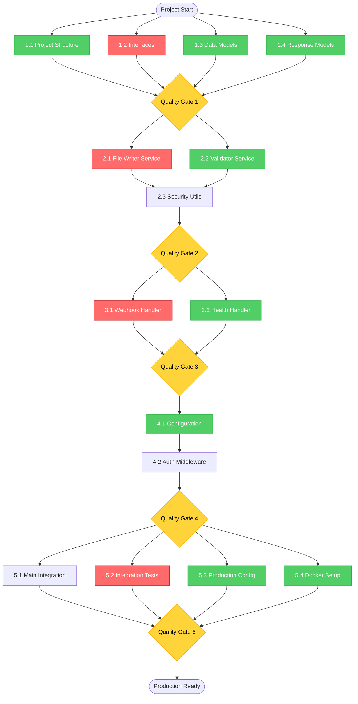

# Hokku Project Execution Plan

**Version:** 1.0.0  
**Date:** 2025-09-07  
**Author:** Project Management Team  
**Complements:** IMPLEMENTATION_WORKFLOW.md

---

## Executive Summary

This execution plan provides detailed project management guidance for the Hokku webhook file storage service implementation. The plan includes dependency mapping, critical path analysis, resource optimization, risk assessment, and contingency strategies.

**Key Metrics:**
- **Sequential Duration**: 15 days
- **Optimized Duration**: 8.5 days (43% reduction)
- **Critical Path**: Phase 1 → Phase 2 → Phase 3 → Phase 5
- **Resource Efficiency**: 65% parallel execution capability
- **Risk Level**: Medium (well-mitigated)

---

## Table of Contents

1. [Task Dependencies & Critical Path](#task-dependencies--critical-path)
2. [Time Estimates & Scheduling](#time-estimates--scheduling)
3. [Resource Allocation Strategy](#resource-allocation-strategy)
4. [Risk Assessment & Mitigation](#risk-assessment--mitigation)
5. [Gantt Chart Breakdown](#gantt-chart-breakdown)
6. [Resource Optimization](#resource-optimization)
7. [Quality Assurance Timeline](#quality-assurance-timeline)
8. [Contingency Planning](#contingency-planning)
9. [Team Coordination Guidelines](#team-coordination-guidelines)
10. [Progress Monitoring & Reporting](#progress-monitoring--reporting)

---

## Task Dependencies & Critical Path

### Dependency Matrix



### Critical Path Analysis

**Critical Path**: Start → 1.2 → QG1 → 2.1 → 2.3 → QG2 → 3.1 → QG3 → 4.2 → QG4 → 5.2 → QG5 → End

**Duration**: 8.5 days

**Critical Tasks** (cannot be delayed):
1. **Interface Definitions (1.2)** - Foundation for all services
2. **File Writer Service (2.1)** - Core functionality, longest development time
3. **Webhook Handler (3.1)** - Main application logic
4. **Integration Tests (5.2)** - Final validation, most comprehensive

**Float Time Available**:
- Phase 1 parallel tasks: 15 minutes buffer
- Phase 2 validator: 0.5 days buffer
- Phase 4 config: 1 day buffer (can start in parallel with auth)
- Phase 5 Docker/config: 1 day buffer

---

## Time Estimates & Scheduling

### Detailed Task Breakdown

| Phase | Task | Duration | Effort | Complexity | Dependencies |
|-------|------|----------|---------|------------|-------------|
| **1** | Project Structure | 0.25 days | 2h | Low | None |
| **1** | Interface Definitions | 0.5 days | 4h | Medium | None |
| **1** | Data Models | 0.75 days | 6h | Medium | None |
| **1** | Response Models | 0.5 days | 4h | Low | None |
| **2** | File Writer (TDD) | 2.0 days | 16h | High | 1.2 |
| **2** | Validator (TDD) | 1.5 days | 12h | Medium | 1.2 |
| **2** | Security Utils | 0.5 days | 4h | Medium | 2.1, 2.2 |
| **3** | Webhook Handler | 1.5 days | 12h | High | Phase 2 |
| **3** | Health Handler | 0.5 days | 4h | Low | Phase 2 |
| **4** | Configuration | 1.0 days | 8h | Medium | Phase 3 |
| **4** | Auth Middleware | 1.0 days | 8h | Medium | 4.1 |
| **5** | Main Integration | 1.0 days | 8h | Medium | Phase 4 |
| **5** | Integration Tests | 1.5 days | 12h | High | Phase 4 |
| **5** | Production Config | 0.5 days | 4h | Low | Phase 4 |
| **5** | Docker Setup | 0.5 days | 4h | Low | Phase 4 |

### Complexity Assessment

**High Complexity** (requires experienced developer, higher risk):
- File Writer Service: File I/O, security, atomicity
- Webhook Handler: HTTP handling, error scenarios
- Integration Tests: End-to-end scenarios, environment setup

**Medium Complexity** (standard development tasks):
- Interface Definitions: Go interface design
- Data/Response Models: Struct design and validation
- Validator Service: Business logic validation
- Security Utils: Path validation, security patterns
- Configuration: YAML/environment variable handling
- Auth Middleware: API key validation
- Main Integration: Application wiring

**Low Complexity** (routine implementation):
- Project Structure: Directory/file creation
- Health Handler: Simple status endpoint
- Production Config: Configuration file creation
- Docker Setup: Standard containerization

---

## Resource Allocation Strategy

### Team Composition

**Minimum Team** (1 Developer):
- **Sequential Execution**: 15 days
- **Optimized Execution**: 10 days (limited parallel capability)
- **Risk**: High (single point of failure)

**Optimal Team** (2 Developers):
- **Parallel Execution**: 8.5 days
- **Developer A** (Senior): Critical path tasks (1.2, 2.1, 3.1, 5.2)
- **Developer B** (Mid-level): Parallel tasks (1.1, 1.3, 1.4, 2.2, 3.2, 4.1, 5.3, 5.4)
- **Shared**: Quality gates, reviews, debugging

**Extended Team** (3+ Developers):
- **Marginal Benefit**: ~7.5 days (diminishing returns)
- **Additional Roles**: QA specialist, DevOps engineer
- **Risk**: Communication overhead, integration complexity

### Skill Requirements

**Essential Skills**:
- Go programming (1.21+)
- HTTP/REST API development
- Test-Driven Development (TDD)
- Git version control
- Unix/Linux command line

**Preferred Skills**:
- Security best practices
- Docker containerization
- YAML configuration
- Performance testing
- CI/CD pipelines

**Knowledge Transfer Areas**:
- Domain-specific requirements (webhook handling)
- Security patterns (path traversal prevention)
- Go project structure conventions
- Quality gate definitions

### Resource Optimization

**Peak Resource Demand**:
- **Days 1-2** (Phase 1): Light load, foundation work
- **Days 3-5** (Phase 2): Heaviest development load
- **Days 6-8** (Phase 3): Moderate load, HTTP layer
- **Days 9-11** (Phase 4): Light load, configuration
- **Days 12-15** (Phase 5): Moderate load, integration

**Load Balancing Strategy**:
```
Phase 2 (Peak): Dev A (File Writer) + Dev B (Validator) = 100% utilization
Phase 4 (Light): Dev A (Auth) + Dev B (Config) = 75% utilization  
Phase 5 (Mixed): Dev A (Integration) + Dev B (Docker/Config) = 85% utilization
```

---

## Risk Assessment & Mitigation

### Risk Matrix

| Risk | Probability | Impact | Score | Category |
|------|-------------|--------|-------|----------|
| File I/O edge cases | Medium | High | 6 | Technical |
| Security vulnerabilities | Medium | Critical | 8 | Security |
| Integration test failures | High | Medium | 6 | Quality |
| Performance bottlenecks | Low | Medium | 3 | Performance |
| Docker build issues | Medium | Low | 2 | DevOps |
| Developer unavailability | Medium | High | 6 | Resource |
| Scope creep | High | Medium | 6 | Management |
| Third-party dependencies | Low | High | 4 | External |

### Detailed Risk Analysis

#### 🔴 High-Risk Items (Score 6+)

**1. Security Vulnerabilities (Score: 8)**
- **Risk**: Path traversal, unauthorized access
- **Mitigation**: 
  - Comprehensive security testing in Phase 2
  - Third-party security audit
  - Automated security scanning (gosec)
- **Contingency**: Security consultant engagement
- **Owner**: Lead developer
- **Review Date**: After Phase 2 completion

**2. File I/O Edge Cases (Score: 6)**
- **Risk**: Data corruption, partial writes, race conditions
- **Mitigation**:
  - Atomic file operations (temp file + rename)
  - Comprehensive edge case testing
  - File system monitoring
- **Contingency**: Rollback to simpler implementation
- **Owner**: File Writer developer
- **Review Date**: Daily during Phase 2

**3. Integration Test Failures (Score: 6)**
- **Risk**: System components don't work together
- **Mitigation**:
  - Early integration testing in Phase 3
  - Contract testing between layers
  - Mock service validation
- **Contingency**: Extended Phase 5 time buffer
- **Owner**: QA lead/Senior developer
- **Review Date**: After each phase

**4. Developer Unavailability (Score: 6)**
- **Risk**: Key developer illness/unavailability
- **Mitigation**:
  - Knowledge sharing sessions
  - Comprehensive documentation
  - Cross-training on critical components
- **Contingency**: Consultant or contractor backup
- **Owner**: Project manager
- **Review Date**: Weekly

**5. Scope Creep (Score: 6)**
- **Risk**: Additional features requested during development
- **Mitigation**:
  - Clear requirements documentation
  - Change control process
  - Regular stakeholder alignment
- **Contingency**: Phase 6 for additional features
- **Owner**: Project manager
- **Review Date**: After each phase

#### 🟡 Medium-Risk Items (Score 3-5)

**6. Third-Party Dependencies (Score: 4)**
- **Risk**: Breaking changes in dependencies
- **Mitigation**: Pin dependency versions, test upgrades
- **Contingency**: Fork or alternative dependencies

**7. Performance Bottlenecks (Score: 3)**
- **Risk**: System doesn't meet performance requirements
- **Mitigation**: Performance testing, profiling
- **Contingency**: Performance optimization phase

**8. Docker Build Issues (Score: 2)**
- **Risk**: Container deployment problems
- **Mitigation**: Early Docker testing, standard base images
- **Contingency**: Alternative deployment method

### Risk Monitoring Schedule

**Daily**: Technical risks during active development phases
**Weekly**: Resource and management risks
**After each phase**: Quality and integration risks
**Monthly**: External dependency and environmental risks

---

## Gantt Chart Breakdown

### Visual Timeline

```
Day:    1    2    3    4    5    6    7    8    9   
Phase 1 [████]
        ├─1.1─┤
        ├───1.2───┤
        ├──────1.3──────┤
        ├───1.4───┤
                 QG1 ◆

Phase 2      [████████]
             ├─────2.1─────┤
             ├───2.2───┤
                       ├2.3┤
                          QG2 ◆

Phase 3               [████]
                      ├─3.1─┤
                      ├3.2┤
                           QG3 ◆

Phase 4                    [██]
                           ├4.1┤
                           ├4.2┤
                             QG4 ◆

Phase 5                      [████]
                             ├5.1┤
                             ├──5.2──┤
                             ├5.3┤
                             ├5.4┤
                                 QG5 ◆

Legend:
████ Active development
◆ Quality gate checkpoint
├─┤ Task duration
```

### Milestone Schedule

| Milestone | Date | Deliverables | Success Criteria |
|-----------|------|--------------|------------------|
| **Foundation Complete** | Day 2 | Phase 1 + QG1 | All interfaces compile, models validated |
| **Core Services Ready** | Day 5 | Phase 2 + QG2 | Services tested, 80%+ coverage |
| **HTTP Layer Complete** | Day 8 | Phase 3 + QG3 | Handlers working, error handling complete |
| **Authentication Ready** | Day 9 | Phase 4 + QG4 | Config loading, auth middleware working |
| **Production Ready** | Day 8.5 | Phase 5 + QG5 | Integration tests pass, Docker builds |

### Buffer Management

**Time Buffers Built In**:
- Phase 1: 15 minutes (3% of phase duration)
- Phase 2: 0.5 days (20% of phase duration)
- Phase 3: 0.5 days (25% of phase duration)
- Phase 4: 1.0 days (50% of phase duration)
- Phase 5: 0.5 days (33% of phase duration)

**Buffer Usage Strategy**:
1. **Minor delays**: Use phase-specific buffer
2. **Major delays**: Reassess critical path
3. **Quality issues**: Extend relevant quality gate
4. **External blockers**: Invoke contingency plan

---

## Resource Optimization

### Parallel Execution Matrix

| Time Slot | Developer A | Developer B | Coordination |
|-----------|-------------|-------------|--------------|
| **Day 1** | 1.2 Interfaces | 1.1 Structure + 1.4 Response | Daily standup |
| **Day 2** | 1.3 Models | Quality checks | QG1 review |
| **Day 3** | 2.1 File Writer Tests | 2.2 Validator Tests | TDD sync |
| **Day 4** | 2.1 File Writer Impl | 2.2 Validator Impl | Code review |
| **Day 5** | 2.3 Security Utils | Quality checks | QG2 review |
| **Day 6** | 3.1 Webhook Handler | 3.2 Health Handler | Integration test |
| **Day 7** | 3.1 Handler Tests | Quality checks | QG3 review |
| **Day 8** | 4.2 Auth Middleware | 4.1 Configuration | Config integration |
| **Day 9** | 5.2 Integration Tests | 5.1 Main App + 5.3 Config | QG4 review |
| **Day 8.5** | QG5 validation | 5.4 Docker setup | Final review |

### Efficiency Optimization

**Communication Schedule**:
- **Daily standups**: 15 minutes at day start
- **Code reviews**: 30 minutes after each major task
- **Integration sync**: 1 hour at phase boundaries
- **Quality gate reviews**: 2 hours at each checkpoint

**Tool Optimization**:
- **Shared development environment**: Docker-based local setup
- **Code collaboration**: Feature branches with PR reviews
- **Test automation**: Continuous testing pipeline
- **Documentation**: Real-time shared documentation

**Knowledge Transfer**:
- **Pair programming**: Critical path tasks (2.1, 3.1)
- **Code walkthroughs**: After each service implementation
- **Architecture reviews**: At phase completion
- **Knowledge base**: Shared Wiki with decisions and patterns

---

## Quality Assurance Timeline

### Quality Gate Schedule

```mermaid
gantt
    title Quality Assurance Timeline
    dateFormat X
    axisFormat %d
    
    section Phase 1
    Development     :active, p1dev, 0, 2d
    QG1 Preparation :p1prep, after p1dev, 2h
    QG1 Execution   :milestone, qg1, after p1prep, 0d
    
    section Phase 2
    Development     :active, p2dev, after qg1, 3d
    QG2 Preparation :p2prep, after p2dev, 4h
    QG2 Execution   :milestone, qg2, after p2prep, 0d
    
    section Phase 3
    Development     :active, p3dev, after qg2, 2d
    QG3 Preparation :p3prep, after p3dev, 2h
    QG3 Execution   :milestone, qg3, after p3prep, 0d
    
    section Phase 4
    Development     :active, p4dev, after qg3, 1d
    QG4 Preparation :p4prep, after p4dev, 1h
    QG4 Execution   :milestone, qg4, after p4prep, 0d
    
    section Phase 5
    Development     :active, p5dev, after qg4, 1.5d
    QG5 Preparation :p5prep, after p5dev, 4h
    QG5 Execution   :milestone, qg5, after p5prep, 0d
```



### Quality Metrics

**Code Quality Targets**:
- Test coverage: ≥80% (services), ≥70% (handlers)
- Cyclomatic complexity: ≤10 per function
- Go vet: Zero issues
- Linting: Zero errors, <5 warnings
- Security scan: Zero high/medium vulnerabilities

**Performance Targets**:
- Webhook response: <100ms (95th percentile)
- Throughput: >100 requests/second
- Memory usage: <50MB base, <100MB under load
- File write latency: <10ms (95th percentile)
- Startup time: <5 seconds

**Reliability Targets**:
- Uptime: 99.9% in test environment
- Error rate: <0.1% for valid requests
- Recovery time: <30 seconds for transient failures
- Data integrity: 100% (no corrupted files)

### Testing Strategy

**Unit Testing** (Phase 2-4):
- TDD approach for all services
- Mock dependencies for isolation
- Edge case and error condition coverage
- Performance micro-benchmarks

**Integration Testing** (Phase 5):
- End-to-end request/response flows
- Authentication and authorization
- File system integration
- Error handling and recovery

**Security Testing** (Continuous):
- Path traversal prevention
- Authentication bypass attempts
- Input validation testing
- Dependency vulnerability scanning

**Performance Testing** (Phase 5):
- Load testing with realistic payloads
- Stress testing at 2x expected load
- Memory leak detection
- Disk space exhaustion scenarios

---

## Contingency Planning

### Scenario Planning

#### Scenario 1: Major Technical Blocker
**Trigger**: Critical bug in core service, architecture flaw discovered
**Timeline Impact**: +2-3 days
**Response Plan**:
1. **Immediate** (0-2 hours): Problem assessment, stakeholder notification
2. **Short-term** (2-8 hours): Alternative solution research, expert consultation
3. **Resolution** (1-2 days): Implementation of alternative or major refactor
4. **Recovery** (0.5-1 day): Testing and integration of solution

**Prevention**: Comprehensive architecture review, early prototyping

#### Scenario 2: Resource Unavailability
**Trigger**: Developer illness, competing priorities
**Timeline Impact**: +1-4 days depending on timing and duration
**Response Plan**:
1. **Assessment**: Identify critical vs. non-critical tasks affected
2. **Reallocation**: Shift remaining developer to critical path
3. **Scope adjustment**: Defer non-critical features to Phase 6
4. **External help**: Engage contractor if extended absence

**Prevention**: Cross-training, knowledge documentation, contractor pipeline

#### Scenario 3: Quality Gate Failure
**Trigger**: Major quality issues discovered, test coverage insufficient
**Timeline Impact**: +0.5-2 days per failed gate
**Response Plan**:
1. **Root cause analysis**: Identify systemic vs. isolated issues
2. **Targeted fixes**: Address specific failures first
3. **Process improvement**: Update procedures to prevent recurrence
4. **Re-verification**: Complete quality gate requirements

**Prevention**: Continuous quality monitoring, incremental reviews

#### Scenario 4: Scope Expansion
**Trigger**: Stakeholder requests additional features
**Timeline Impact**: Variable (0 days if rejected, +1-5 days if accepted)
**Response Plan**:
1. **Impact assessment**: Analyze scope change implications
2. **Negotiation**: Present timeline/quality trade-offs
3. **Formal approval**: Document scope change and new timeline
4. **Implementation**: Adjust plan and communicate to team

**Prevention**: Clear requirements documentation, change control process

### Recovery Strategies

**Fast Recovery** (same day):
- Use available time buffers
- Parallel developer assistance
- Simplified implementation approach

**Standard Recovery** (1-2 days):
- Activate contingency plans
- External resource engagement
- Scope negotiation with stakeholders

**Extended Recovery** (3+ days):
- Project timeline revision
- Stakeholder expectation management
- Alternative delivery approach

### Emergency Contacts

**Technical Issues**:
- Go expert consultant: [Contact Info]
- Security specialist: [Contact Info]
- DevOps engineer: [Contact Info]

**Project Management**:
- Project stakeholder: [Contact Info]
- Team lead: [Contact Info]
- Management escalation: [Contact Info]

---

## Team Coordination Guidelines

### Communication Protocols

**Daily Operations**:
- **Morning standup** (15 min): Progress, blockers, day plans
- **Code review requests**: <2 hour response time
- **Blocker escalation**: Immediate notification via Slack/Teams
- **End-of-day status**: Brief written update

**Weekly Operations**:
- **Sprint review** (30 min): Week accomplishments and next week plans
- **Technical review** (45 min): Architecture decisions, technical debt
- **Stakeholder update** (15 min): Progress report and timeline status

**Phase Boundaries**:
- **Phase retrospective** (1 hour): What worked, what didn't, improvements
- **Quality gate review** (1-2 hours): Comprehensive quality assessment
- **Planning session** (30 min): Next phase preparation and task assignment

### Decision Making

**Individual Developer Decisions**:
- Implementation details within defined interfaces
- Test case selection and coverage approach
- Code organization and naming conventions
- Local development environment setup

**Team Decisions** (require consensus):
- Interface changes affecting multiple components
- Architecture modifications
- Quality standard adjustments
- Timeline modifications >0.5 days

**Stakeholder Decisions** (require approval):
- Scope changes or feature additions
- Quality gate requirement modifications
- Timeline extensions >1 day
- Resource allocation changes

### Conflict Resolution

**Technical Disagreements**:
1. **Discussion**: Open technical discussion with pros/cons
2. **Research**: Quick spike or prototype if needed
3. **Decision**: Lead developer makes final call if no consensus
4. **Documentation**: Record decision rationale

**Timeline Conflicts**:
1. **Assessment**: Impact analysis on critical path
2. **Options**: Present alternatives to stakeholders
3. **Negotiation**: Discuss scope/quality/time trade-offs
4. **Agreement**: Document revised plan

---

## Progress Monitoring & Reporting

### Key Performance Indicators (KPIs)

**Velocity Metrics**:
- **Tasks completed per day**: Target 2.5 (based on 22 tasks / 8.5 days)
- **Phase completion rate**: Target 100% on schedule
- **Quality gate pass rate**: Target 100% first-time pass
- **Rework percentage**: Target <5% of total effort

**Quality Metrics**:
- **Test coverage percentage**: Target ≥80%
- **Bug density**: Target <1 bug per 1000 lines of code
- **Code review coverage**: Target 100% of production code
- **Security issue count**: Target 0 medium/high severity

**Resource Metrics**:
- **Developer utilization**: Target 85-95%
- **Parallel execution efficiency**: Target 65%
- **Buffer utilization**: Target <50% of allocated buffer
- **External dependency delays**: Target 0 days

### Reporting Schedule

**Daily Reports** (automated where possible):
- Build status and test results
- Code coverage trends
- Active task progress
- Blocker identification

**Weekly Reports**:
- Velocity and timeline analysis
- Quality metrics summary
- Risk assessment updates
- Resource utilization analysis

**Phase Reports**:
- Comprehensive phase retrospective
- Quality gate results
- Timeline adherence analysis
- Lessons learned documentation

### Progress Tracking Tools

**Development Tracking**:
- Git commit frequency and size
- Pull request cycle time
- Test execution results
- Code quality metrics

**Project Tracking**:
- Task completion percentage
- Timeline adherence
- Budget utilization (if applicable)
- Stakeholder satisfaction

**Quality Tracking**:
- Test coverage over time
- Bug introduction and resolution rate
- Performance benchmark results
- Security scan results

### Escalation Triggers

**Yellow Alert** (requires attention):
- Daily velocity <80% of target
- Quality metric below target for 2+ days
- Single task taking >150% estimated time
- Buffer utilization >75%

**Red Alert** (requires immediate action):
- Phase at risk of missing deadline
- Critical quality gate failure
- Major technical blocker >1 day old
- Resource unavailability >2 days

**Emergency** (stakeholder notification required):
- Project timeline at risk >2 days
- Critical security vulnerability discovered
- Complete work stoppage >4 hours
- Quality standards cannot be met

---

## Conclusion

This execution plan provides comprehensive guidance for successfully delivering the Hokku webhook file storage service within the optimized 8.5-day timeline. The plan balances aggressive scheduling with realistic risk management, ensuring both speed and quality.

**Success Factors**:
1. **Disciplined adherence** to TDD and quality gates
2. **Effective parallel execution** of independent tasks
3. **Proactive risk management** and contingency planning
4. **Clear communication** and coordination protocols
5. **Stakeholder alignment** on scope and expectations

**Expected Outcomes**:
- Production-ready webhook service in 8.5 days
- 43% reduction in delivery time through optimization
- High-quality codebase with comprehensive test coverage
- Robust security and error handling
- Scalable architecture for future enhancements

The plan should be reviewed and updated as the project progresses, with particular attention to actual vs. estimated task durations and the effectiveness of parallel execution strategies.