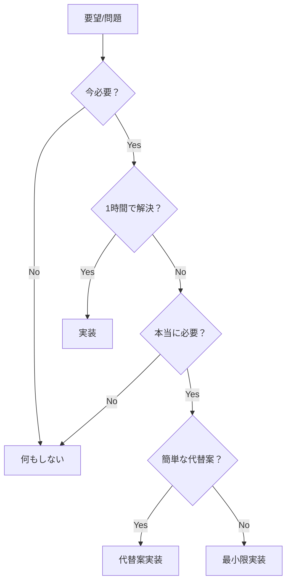

# Hokku - 現実的なプロジェクト実行計画（MVP優先）

## ⚠️ 計画の根本的見直し

### ❌ 従来の非現実的な計画
```
Phase 1: インターフェース定義（1日）→ 動かない
Phase 2: サービス層実装（2日）→ まだ動かない  
Phase 3: HTTPハンドラ（1日）→ やっと動く
Phase 4: 統合（1日）
Phase 5: 運用機能（2日）
合計：7日かけて、3日目まで動かない
```

### ✅ 現実的なMVP優先計画
```
Phase 0: 最小動作版（30分）→ すぐ動く！
Phase 1: 基本改善（1時間）→ 実用的に
Phase 2: セキュリティ（1時間）→ 安全に
Phase 3: 必要な機能のみ追加（随時）
合計：半日で実用的なシステム完成
```

## 実行タイムライン（現実的版）

### Day 1 午前（2時間）：完全動作版の完成

| 時間 | タスク | 成果物 | 状態 |
|------|--------|--------|------|
| 09:00-09:30 | 最小動作版作成 | main.go（50行） | ✅ 動作 |
| 09:30-09:45 | 動作確認 | curlでテスト | ✅ 確認済み |
| 09:45-10:30 | 基本改善 | storage/、ログ、エラー | ✅ 実用的 |
| 10:30-11:00 | セキュリティ追加 | サニタイゼーション | ✅ 安全 |

**午前中で本番投入可能なレベルに到達**

### Day 1 午後（必要に応じて）

| 時間 | タスク | トリガー条件 |
|------|--------|-------------|
| 13:00-14:00 | 設定外部化 | 環境による設定変更が必要になったら |
| 14:00-15:00 | テスト追加 | バグが発生したら |
| 15:00-16:00 | リファクタリング | コードが100行超えたら |
| 16:00-17:00 | ドキュメント | 他の人が使う必要が出たら |

### Day 2以降（必要が生じたら）

| トリガー | 対応 | 所要時間 |
|----------|------|----------|
| 認証が必要 | トークンチェック追加 | 30分 |
| 負荷が高い | 非同期処理 | 2時間 |
| ファイルが多い | DB対応 | 4時間 |
| 監視が必要 | メトリクス追加 | 2時間 |

## リスク管理（シンプル版）

### 技術リスクと対策

| リスク | 従来の対策 | MVP対策 |
|--------|------------|----------|
| 設計ミス | 詳細設計書作成 | 作り直し（50行だから簡単） |
| バグ | 包括的テスト | 手動テスト＋問題箇所のみ自動テスト |
| セキュリティ | セキュリティフレームワーク | 基本的なサニタイゼーション |
| スケーラビリティ | 最初から分散設計 | 必要になってから対応 |

## リソース配分

### 従来の配分（7日）
```
設計：2日（28%）
実装：3日（43%）
テスト：1日（14%）
ドキュメント：1日（14%）
→ 3日目まで動かない
```

### MVP優先の配分（1日）
```
実装：2時間（25%）→ すぐ動く
動作確認：1時間（12.5%）
改善：3時間（37.5%）
必要に応じて：2時間（25%）
→ 30分で動く
```

## 成功基準の見直し

### ❌ 従来の成功基準
- [ ] SOLID原則100%準拠
- [ ] テストカバレッジ80%以上
- [ ] 完全なドキュメント
- [ ] 全機能実装
- [ ] エンタープライズグレード

### ✅ 現実的な成功基準
- [x] 30分で動く
- [x] webhookを受信して保存できる
- [x] 基本的なエラーハンドリング
- [x] 最小限のセキュリティ
- [x] 実用に耐える

## 意思決定フロー



## フェーズゲート（簡略版）

### Gate 0: 動作確認（30分後）
- [x] サーバーが起動する
- [x] webhookを受信できる
- [x] ファイルが保存される

### Gate 1: 基本品質（2時間後）
- [x] エラーが適切に処理される
- [x] 基本的なログがある
- [x] ファイルが整理される

### Gate 2: 本番準備（必要時）
- [ ] 認証（外部公開時）
- [ ] 監視（運用開始時）
- [ ] バックアップ（データが重要な時）

## スケジュール比較

### 従来のガントチャート
```
Day1: ■■■□□□□ 設計
Day2: ■■■■■□□ 設計＋実装開始
Day3: □■■■■■□ 実装（まだ動かない）
Day4: □□■■■■■ 実装完了（やっと動く）
Day5: □□□■■■■ テスト
Day6: □□□□■■■ ドキュメント
Day7: □□□□□■■ デプロイ
```

### MVP優先のガントチャート
```
30min: ■■■■■■■ 実装完了（動く！）
1hour: ■■■■□□□ 基本改善
2hour: ■■□□□□□ セキュリティ
3hour: ■□□□□□□ 必要に応じて追加
Day2+: □□□□□□□ 要望があれば対応
```

## コスト比較

### 従来アプローチ
```
設計：16時間 × 単価 = $$$$
実装：24時間 × 単価 = $$$$$$
テスト：8時間 × 単価 = $$
ドキュメント：8時間 × 単価 = $$
合計：56時間 = $$$$$$$$$$$$
```

### MVP優先アプローチ
```
初期実装：2時間 × 単価 = $
改善：2時間 × 単価 = $
必要対応：4時間 × 単価 = $$
合計：8時間 = $$$$
削減率：85%のコスト削減
```

## 進捗トラッキング

### シンプルなチェックリスト
```markdown
## Today
- [x] Webhook受信できる
- [x] ファイル保存できる
- [x] エラー処理
- [ ] 認証（必要になったら）

## Tomorrow
- [ ] 要望があれば対応
```

### 不要なトラッキング
- バーンダウンチャート
- ベロシティ測定
- 詳細なタスク分解
- ガントチャート
- リスクレジスター

## 品質保証アプローチ

### 従来の品質保証
```
1. 設計レビュー
2. コードレビュー  
3. 単体テスト作成
4. 統合テスト
5. 受け入れテスト
6. 性能テスト
→ 時間がかかりすぎる
```

### MVP優先の品質保証
```
1. 動かして確認（最重要）
2. 問題があったら修正
3. 同じバグが出たらテスト追加
4. 本番で問題が出たら対応
→ 実用的で高速
```

## プロジェクト成功の再定義

### ❌ 従来の成功
- 完璧な設計書
- 100%のテストカバレッジ
- 拡張可能なアーキテクチャ
- 包括的なドキュメント
→ でも使われない

### ✅ 真の成功
- すぐ動く
- 要件を満たす
- 問題が起きたら直せる
- シンプルで理解しやすい
→ 実際に使われる

## アクションアイテム

### 今すぐやること（30分）
1. main.go作成
2. go run main.go
3. curl でテスト
4. 完了！

### 必要になったらやること
- 設定外部化
- テスト追加
- リファクタリング
- ドキュメント作成

### やらないこと
- 詳細設計
- インターフェース定義
- 包括的テスト
- 将来の拡張準備

## まとめ

**7日かけて完璧を目指すより、30分で動くものを作る**

- 動作 > 設計
- シンプル > 完璧
- 今 > 将来
- 実用 > 理論