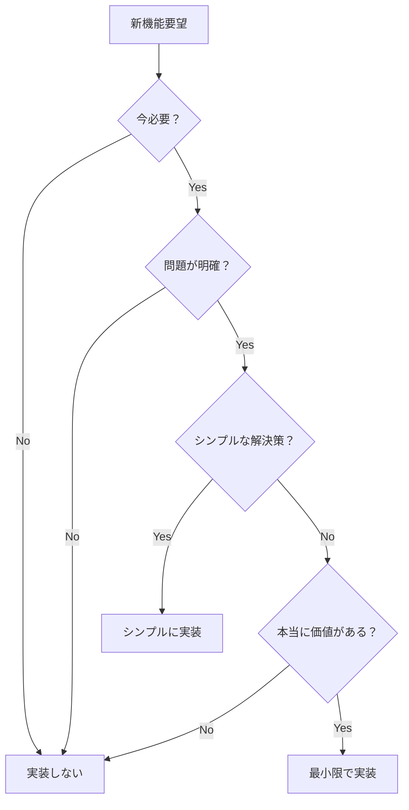

# Hokku - 段階的進化型設計仕様書（MVP優先）

## ⚠️ 重要：設計アプローチの根本的な転換

### ❌ 従来の誤ったアプローチ
```
最初から：
- SOLID原則の完全適用
- インターフェース定義
- 依存性注入の実装
- 複雑な抽象化層
→ 結果：動作しない過剰設計
```

### ✅ 正しいアプローチ：MVP優先の段階的進化
```
1. 動く最小版を作る（50行）
2. 実際に使って問題を発見
3. 問題があれば改善
4. 必要になったら抽象化
5. 本当に必要ならSOLID適用
```

## Phase 0: 最小動作版（MVP）

### 目標
- **動作すること**が最優先
- 50行以内の単一ファイル
- 抽象化なし、インターフェースなし

### 実装
```go
// main.go - 完全に動作する最小版
package main

import (
    "encoding/json"
    "fmt"
    "io"
    "net/http"
    "os"
    "time"
)

func main() {
    http.HandleFunc("/webhook", func(w http.ResponseWriter, r *http.Request) {
        body, _ := io.ReadAll(r.Body)
        
        var data map[string]interface{}
        if json.Unmarshal(body, &data) != nil {
            http.Error(w, "Invalid JSON", 400)
            return
        }
        
        filename := fmt.Sprintf("webhook_%d.json", time.Now().Unix())
        os.WriteFile(filename, body, 0644)
        
        w.WriteHeader(200)
        json.NewEncoder(w).Encode(map[string]string{"status": "saved", "file": filename})
    })
    
    http.ListenAndServe(":8080", nil)
}
```

### YAGNI適用
- ❌ 設定ファイル → 環境変数すら不要
- ❌ ログフレームワーク → fmt.Println で十分
- ❌ エラー型定義 → 標準エラーで十分
- ❌ インターフェース → 具体実装のみ

## Phase 1: 基本改善（問題が発生したら）

### トリガー条件
- ファイルが散らかる → storageディレクトリ作成
- エラーが分かりにくい → 基本的なログ追加
- 必須フィールドがない → タイトルチェック追加

### 実装例（差分のみ）
```go
// +10行程度の追加
os.MkdirAll("storage", 0755)

if data["title"] == nil {
    http.Error(w, "title required", 400)
    return
}

title := fmt.Sprintf("%v", data["title"])
filename := fmt.Sprintf("storage/%d_%s.json", time.Now().Unix(), title)
log.Printf("Saved webhook: %s", filename)
```

### YAGNI適用
- ❌ 複雑なバリデーション → 最小限のチェックのみ
- ❌ カスタムエラー型 → 文字列メッセージで十分
- ❌ 構造体定義 → map[string]interface{} で十分

## Phase 2: セキュリティ最小限（脆弱性が見つかったら）

### トリガー条件
- パストラバーサル攻撃の可能性 → サニタイゼーション追加
- 認証が必要 → シンプルなトークンチェック

### 実装例
```go
// +15行程度の追加
func sanitize(s string) string {
    // 危険な文字を置換
    s = strings.ReplaceAll(s, "/", "_")
    s = strings.ReplaceAll(s, "..", "_")
    return s
}

// 使用箇所
title = sanitize(title)
```

### YAGNI適用
- ❌ 複雑な認証システム → Bearer トークンで十分
- ❌ 完璧なサニタイゼーション → 基本的な置換で十分
- ❌ セキュリティフレームワーク → 標準ライブラリで十分

## Phase 3: 構造化（100行を超えたら）

### トリガー条件
- main関数が長すぎる → 関数分割
- 設定が増えた → 構造体にまとめる

### 実装例
```go
// 関数に分割（インターフェースはまだ不要）
func handleWebhook(w http.ResponseWriter, r *http.Request) {
    // 処理
}

func saveToFile(data []byte, title string) (string, error) {
    // ファイル保存
}

func main() {
    http.HandleFunc("/webhook", handleWebhook)
    http.ListenAndServe(":8080", nil)
}
```

### YAGNI適用
- ❌ インターフェース定義 → 具体的な関数で十分
- ❌ 依存性注入 → 直接呼び出しで十分
- ❌ パッケージ分割 → 単一ファイルで十分

## Phase 4: パッケージ分割（500行を超えたら）

### トリガー条件
- ファイルが大きすぎる → 責任ごとに分割
- テストが必要 → テスト可能な構造に

### 実装例
```
hokku/
├── main.go           # 100行以内
├── handler.go        # HTTP処理
├── storage.go        # ファイル保存
└── config.go         # 設定（必要なら）
```

### YAGNI適用
- ❌ internal/external分離 → フラットで十分
- ❌ 複雑なディレクトリ構造 → シンプルに保つ
- ❌ 汎用ライブラリ化 → このプロジェクト専用で十分

## Phase 5: インターフェース導入（本当に必要になったら）

### トリガー条件
- 複数の実装が必要 → インターフェース定義
- モックが必要 → テスト用インターフェース
- 外部パッケージ化 → 公開インターフェース

### 実装例
```go
// ついに必要になったらインターフェース
type Storage interface {
    Save(data []byte) (string, error)
}

// でも最小限に
type FileStorage struct{}

func (fs *FileStorage) Save(data []byte) (string, error) {
    // 実装
}
```

## SOLID原則の段階的適用

### SRP（単一責任）の進化
```
Phase 0: main関数に全て → 問題なし
Phase 1: 長くなったら関数分割 → 自然にSRP
Phase 2: 関数が増えたらファイル分割 → より明確なSRP
```

### OCP（開放閉鎖）の進化
```
Phase 0: 直接修正 → 問題なし
Phase 1: 設定で挙動変更 → 部分的OCP
Phase 2: インターフェース（必要なら） → 完全なOCP
```

### DIP（依存性逆転）の進化
```
Phase 0: 具体実装に依存 → 問題なし
Phase 1: 関数で抽象化 → 部分的DIP
Phase 2: インターフェース（必要なら） → 完全なDIP
```

## YAGNIチェックリスト

### 実装前に必ず確認
- [ ] 今すぐ必要か？
- [ ] 具体的な問題を解決するか？
- [ ] より簡単な方法はないか？
- [ ] 将来のためだけの実装ではないか？

### 実装しない機能リスト
```
✗ データベース対応（ファイルで十分）
✗ キャッシング（性能問題なし）
✗ 非同期処理（同期で十分）
✗ プラグインシステム（拡張不要）
✗ 国際化（日本語のみ）
✗ メトリクス収集（ログで十分）
✗ 分散対応（単一サーバー）
✗ WebSocket（HTTPで十分）
```

## 判断基準

### 機能追加の判断フロー


## プロジェクト構造の進化

### Stage 0: 単一ファイル（推奨開始点）
```
hokku/
└── main.go              # 全て
```

### Stage 1: 基本分割（200行超えたら）
```
hokku/
├── main.go              # エントリーポイント
├── handler.go           # ハンドラ
└── storage.go           # ストレージ
```

### Stage 2: テスト追加（必要になったら）
```
hokku/
├── main.go
├── handler.go
├── handler_test.go      # テスト
├── storage.go
└── storage_test.go
```

### Stage 3: パッケージ化（1000行超えたら）
```
hokku/
├── cmd/
│   └── hokku/
│       └── main.go
├── handler/
│   └── webhook.go
└── storage/
    └── file.go
```

## 実装の指針

### 1. 動作優先
```go
// ✅ 良い：動くコード
os.WriteFile("file.json", data, 0644)

// ❌ 悪い：動かない抽象化
type Storage interface {
    Save(data Data) error
}
// 実装なし...
```

### 2. 具体的優先
```go
// ✅ 良い：具体的な実装
func saveWebhook(data []byte) error {
    return os.WriteFile("webhook.json", data, 0644)
}

// ❌ 悪い：不要な抽象化
type Saver interface {
    Save(Saveable) error
}
```

### 3. シンプル優先
```go
// ✅ 良い：シンプル
if title == "" {
    return errors.New("title required")
}

// ❌ 悪い：複雑
type ValidationRule interface {
    Validate(interface{}) error
}
type RequiredFieldValidator struct {
    Field string
}
```

## まとめ

1. **最小動作版から始める**（50行のmain.go）
2. **問題が発生してから解決する**
3. **シンプルな解決策を優先する**
4. **抽象化は最後の手段**
5. **YAGNI > SOLID**（必要になるまでSOLIDは適用しない）

「きれいなコード」より「動くコード」
「完璧な設計」より「シンプルな実装」
「将来の拡張性」より「今の要件」